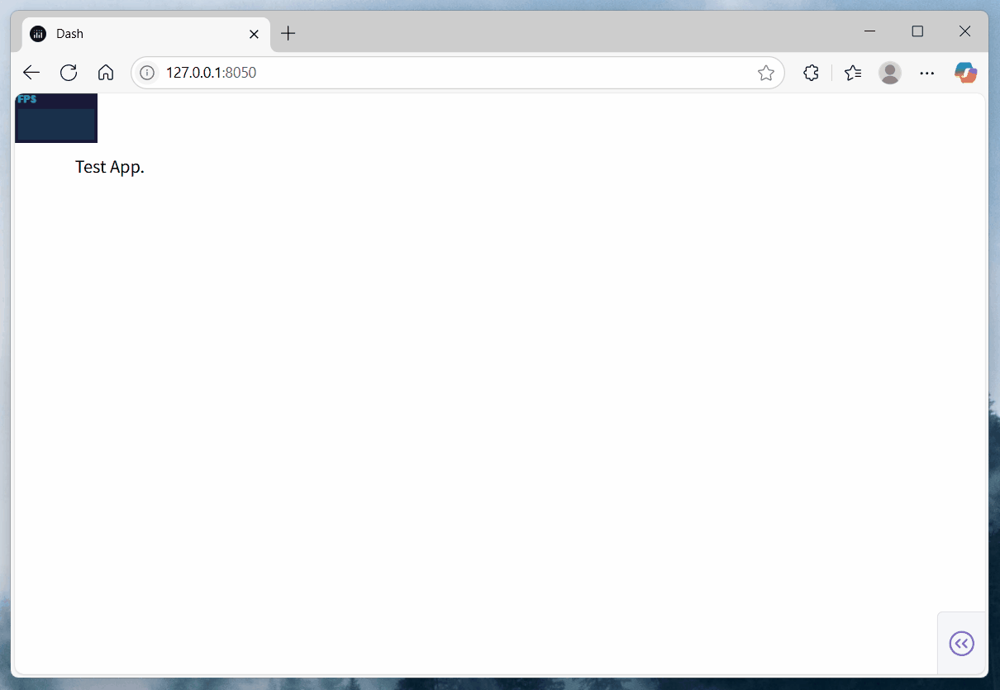

# dash-performance-monitor-plugin

[](https://github.com/CNFeffery/dash-performance-monitor-plugin/blob/main/LICENSE)
[](https://pypi.org/project/dash-performance-monitor-plugin/)
[](https://github.com/astral-sh/ruff)

简体中文 | [English](./README.md)

适用于[Dash](https://github.com/plotly/dash)应用的性能监测插件，基于`Dash Hooks`实现，用于在当前`Dash`应用页面中添加额外的性能监测功能。

## 安装

```bash
pip install dash-performance-monitor-plugin
```

## 使用

```python
from dash import Dash

# 导入插件启用函数
from dash_performance_monitor_plugin import setup_performance_monitor_plugin

# 为当前应用启用插件
setup_performance_monitor_plugin()

app = Dash(__name__)

# 其他应用代码...
```

## 示例

执行示例应用，此示例演示了为`Dash`应用快捷添加额外的性能监视器，可实时显示 FPS（每秒帧数）、MS（每帧毫秒数）和 MB（内存使用量）等信息：

```bash
python example.py
```

<center></center>

## 参数说明

### `setup_performance_monitor_plugin()`

用于为当前`Dash`应用添加额外的性能监控功能。

| 参数         | 类型                | 默认值                                                              | 描述                                                                                                                                                                                  |
| ------------ | ------------------- | ------------------------------------------------------------------- | ------------------------------------------------------------------------------------------------------------------------------------------------------------------------------------- |
| `script_src` | `str`               | `"https://cdn.jsdelivr.net/npm/stats.js@latest/build/stats.min.js"` | 依赖的 stats.js 静态资源地址，常见的可用资源地址有：`https://unpkg.com/stats.js@latest/build/stats.min.js`, `https://registry.npmmirror.com/stats.js/latest/files/build/stats.min.js` |
| `left`       | `Union[int, float]` | `0`                                                                 | 监视器面板左侧像素位置                                                                                                                                                                |
| `top`        | `Union[int, float]` | `0`                                                                 | 监视器面板顶部像素位置                                                                                                                                                                |
| `opacity`    | `Union[int, float]` | `0.9`                                                               | 监视器面板的不透明度（0-1）                                                                                                                                                           |
| `zIndex`     | `int`               | `10000`                                                             | 监视器面板的 z-index 值                                                                                                                                                               |
