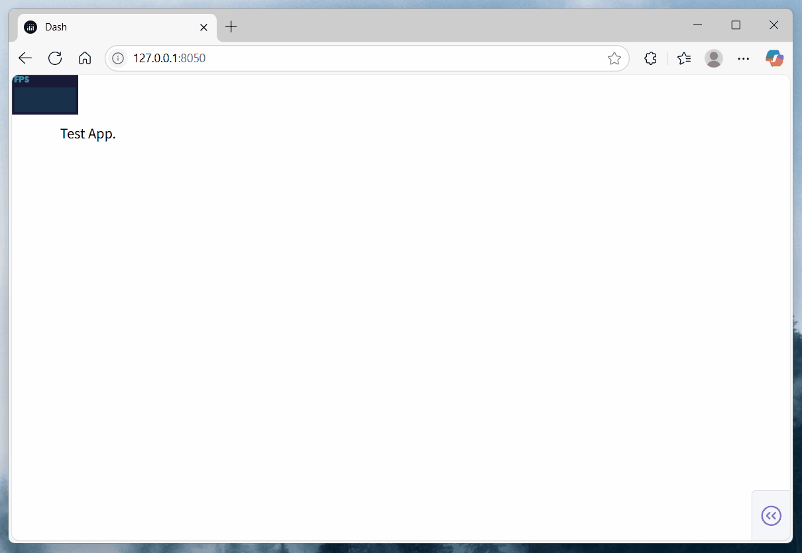

# dash-performance-monitor-plugin

[](https://github.com/CNFeffery/dash-performance-monitor-plugin/blob/main/LICENSE)
[](https://pypi.org/project/dash-performance-monitor-plugin/)
[](https://github.com/astral-sh/ruff)

English | [简体中文](./README-zh_CN.md)

A plugin to add extra performance monitor for Dash applications using Dash Hooks.

## Installation

```bash
pip install dash-performance-monitor-plugin
```

## Usage

```python
from dash import Dash

# Import the performance monitor plugin
from dash_performance_monitor_plugin import setup_performance_monitor_plugin

# Enable the performance monitor plugin for the current app
setup_performance_monitor_plugin()

app = Dash(__name__)

# Rest of your app code...
```

## Example

Run the included example. This example demonstrates how to add a performance monitor to your Dash application, which will show FPS (Frames Per Second), MS (Milliseconds per frame), and MB (Memory usage) in real-time.

```bash
python example.py
```

<center></center>

## API Reference

### `setup_performance_monitor_plugin()`

This function sets up the performance monitor plugin for your Dash application using stats.js.

| Parameter    | Type                | Default                                                             | Description                                                                                                                                                                            |
| ------------ | ------------------- | ------------------------------------------------------------------- | -------------------------------------------------------------------------------------------------------------------------------------------------------------------------------------- |
| `script_src` | `str`               | `"https://cdn.jsdelivr.net/npm/stats.js@latest/build/stats.min.js"` | Source URL of the stats.js script. Alternative CDNs: `https://unpkg.com/stats.js@latest/build/stats.min.js`, `https://registry.npmmirror.com/stats.js/latest/files/build/stats.min.js` |
| `left`       | `Union[int, float]` | `0`                                                                 | The left pixel position of the monitor panel.                                                                                                                                          |
| `top`        | `Union[int, float]` | `0`                                                                 | The top pixel position of the monitor panel.                                                                                                                                           |
| `opacity`    | `Union[int, float]` | `0.9`                                                               | The opacity of the monitor panel (0-1).                                                                                                                                                |
| `zIndex`     | `int`               | `10000`                                                             | The z-index of the monitor panel.                                                                                                                                                      |
